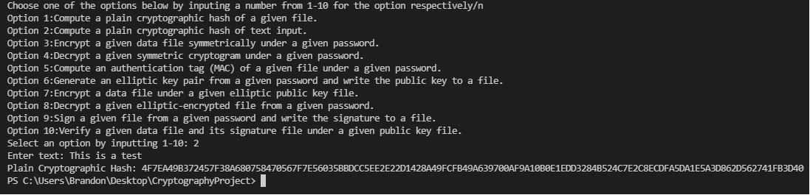

Cryptographic App using cSHAKE256 and KMACxOF256

This is a console application created to provide Cryptographic Hashes to text and files, encrypt adn decrypts passwords, data files,
and create authentication tags and more. There are ten different options listed below

OPTIONS:

Option 1:Compute a plain cryptographic hash of a given file.

Option 2:Compute a plain cryptographic hash of text input.

Option 3:Encrypt a given data file symmetrically under a given password.

Option 4:Decrypt a given symmetric cryptogram under a given password.

Option 5:Compute an authentication tag (MAC) of a given file under a given password.

Option 6:Generate an elliptic key pair from a given password and write the public key to a file.

Option 7:Encrypt a data file under a given elliptic public key file.

Option 8:Decrypt a given elliptic-encrypted file from a given password.

Option 9:Sign a given file from a given password and write the signature to a file.

Option 10:Verify a given data file and its signature file under a given public key file.

Example output below:

